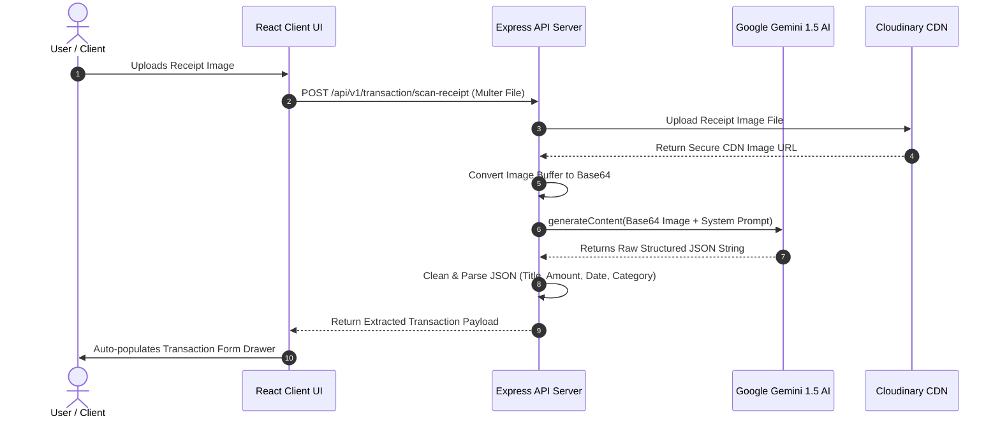
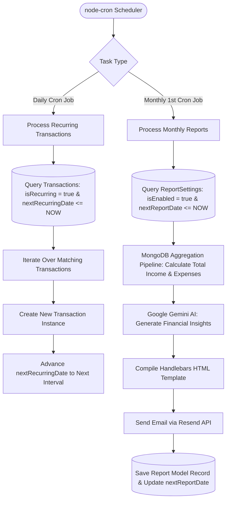
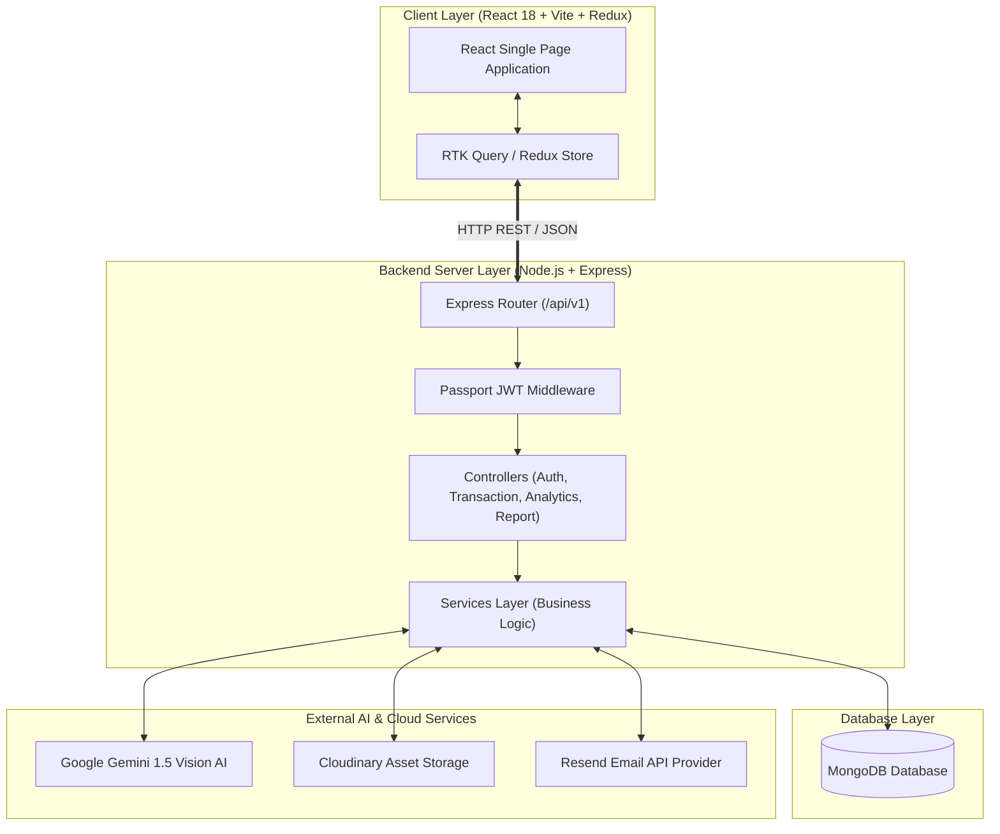
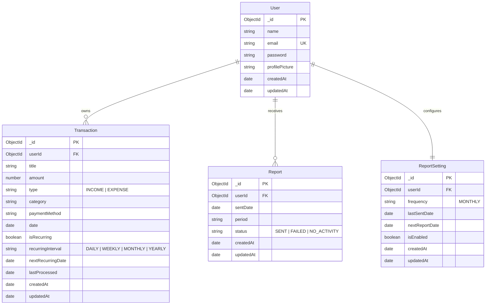

# 💎 Finora — AI-Powered Financial Management SaaS Platform

> **Product Requirements Document (PRD) & Technical Architectural Specification**

Finora is an enterprise-grade, full-stack MERN AI Financial SaaS platform designed for personal finance tracking, intelligent OCR receipt scanning, advanced MongoDB aggregate analytics, and background-automated email reporting.

---

## 📋 Table of Contents
1. [Executive Summary & Product Vision](#-1-executive-summary--product-vision)
2. [Product Requirements Document (PRD)](#-2-product-requirements-document-prd)
3. [Frontend Architecture](#-3-frontend-architecture)
4. [Backend Architecture](#-4-backend-architecture)
5. [Intelligent AI & Agent Architecture](#-5-intelligent-ai--agent-architecture)
6. [Background Cron Automation Engine](#-6-background-cron-automation-engine)
7. [System Architecture & Data Flow Diagrams](#-7-system-architecture--data-flow-diagrams)
8. [Database Schema & Data Models](#-8-database-schema--data-models)
9. [API Endpoint Reference Table](#-9-api-endpoint-reference-table)
10. [Local Setup & Monorepo Development Guide](#-10-local-setup--monorepo-development-guide)
11. [Security, Production Guidelines & License](#-11-security-production-guidelines--license)

---

## 📌 1. Executive Summary & Product Vision

Finora bridges personal wealth management with cutting-edge artificial intelligence. By combining automated receipt scanning using **Google Gemini AI**, interactive financial chart analytics powered by **Recharts**, and an automated background cron engine dispatching periodic reports via **Resend Email**, Finora provides users with real-time financial clarity.

### Key Value Propositions
- **Automated Receipt Parsing**: Upload purchase receipts to auto-populate transaction forms via AI OCR.
- **MongoDB Aggregate Analytics**: Real-time financial income vs. expense pie charts and time-series line trends.
- **Automated Recurring Engine**: Background processing for subscriptions and scheduled monthly email summaries.
- **CSV Bulk Import & Export**: Import financial statements with multi-step column mapping.

---

## 🎯 2. Product Requirements Document (PRD)

### 2.1 User Personas
- **Individual Consumers**: Users wanting an elegant, dark-mode financial dashboard to track monthly expenses.
- **Freelancers / Business Owners**: Power users needing CSV statement imports, automated recurring bills, and AI receipt scanning for tax records.

### 2.2 Functional Requirements Matrix

| Module | Requirement | Details |
|---|---|---|
| **Authentication** | User Auth & JWT Security | Email/Password registration, bcrypt password hashing, Passport.js JWT strategy. |
| **User Settings** | Profile Management | Avatar photo upload via Cloudinary, name updates, and theme toggling (Dark/Light). |
| **Transactions** | Full CRUD & Drawers | Add, edit, delete, duplicate, search keyword, filter by category/type/date, and paginated table. |
| **AI Receipt Scanner** | Multimodal OCR Parsing | Drag-and-drop receipt image upload parsed by Google Gemini 1.5 Flash Vision. |
| **CSV Import** | Bulk Statement Mapping | Multi-step modal for file uploading, field mapping preview, and bulk insertion. |
| **Analytics** | Aggregate Financial Metrics | MongoDB `$facet` pipelines calculating total income, total expense, savings rate, and category breakdowns. |
| **Cron Engine** | Automated Recurring Bills | Background scheduler processing recurring transaction intervals (Daily, Weekly, Monthly, Yearly). |
| **Email Reports** | Scheduled Email Statements | Automated Handlebars HTML monthly financial statement compiled and sent via Resend API. |

---

## 🏗️ 3. Frontend Architecture

The frontend is built with React 18, Vite, TypeScript, and Redux Toolkit. Styling is crafted using Vanilla CSS, Tailwind CSS, and Shadcn UI primitives.

```
client/
├── src/
│   ├── assets/              # Public SVG icons and dashboard preview images
│   ├── components/          # Reusable UI components (Data Table, Drawers, Date Range)
│   │   ├── app-alert.tsx
│   │   ├── data-table/
│   │   ├── date-range-picker/
│   │   ├── date-range-select/
│   │   ├── transaction/     # Receipt scanner, form drawers, CSV import modal
│   │   └── ui/              # Shadcn UI primitives (Button, Calendar, Dialog, Form)
│   ├── constant/            # Category options, payment methods, transaction types
│   ├── context/             # ThemeProvider (Dark / Light mode context)
│   ├── features/            # Redux Toolkit API slices (RTK Query / Axios)
│   │   ├── analytics/
│   │   ├── auth/
│   │   ├── report/
│   │   ├── transaction/
│   │   └── user/
│   ├── pages/               # Application view routes (Dashboard, Settings, Reports, Auth)
│   ├── routes/              # Protected & Public routing guards
│   └── store/               # Redux Toolkit store configuration
```

---

## ⚡ 4. Backend Architecture

The backend is engineered with Node.js, Express.js, TypeScript, and MongoDB (Mongoose ODM). Input payloads are validated using **Zod** schemas.

```
backend/
├── src/
│   ├── @types/              # TypeScript custom type definitions
│   ├── config/              # Configuration (Database, Passport, Gemini AI, Resend, HTTP STATUS)
│   ├── controllers/         # Express Controller Handlers (Auth, Transaction, Analytics, Report)
│   ├── cron/                # Background cron job scheduler and tasks
│   │   ├── index.ts
│   │   ├── scheduler.ts
│   │   └── jobs/            # Recurring transaction & report dispatch jobs
│   ├── enums/               # Date ranges, Transaction types, Error codes
│   ├── mailers/             # Resend mailer client & Handlebars HTML email templates
│   ├── middlewares/         # JWT Authentication & Global Error Handler
│   ├── models/              # Mongoose Database Schemas (User, Transaction, Report, ReportSetting)
│   ├── routes/              # Express API Routes
│   ├── services/            # Core business logic and database queries
│   ├── utils/               # AppError taxonomy, Date helpers, Currency formatters
│   └── validators/          # Zod validation schemas
```

---

## 🤖 5. Intelligent AI & Agent Architecture

Finora incorporates an **Intelligent AI Vision Pipeline** powered by **Google Gemini 1.5 Flash**.



### Prompt Engineering Pipeline
1. **Input Payload**: Image base64 string + receipt OCR system prompt.
2. **Extraction Fields**: `title`, `amount`, `date`, `category`, `paymentMethod`, `type`.
3. **Structured Response**: Gemini returns strict JSON matching expected transaction types, auto-populating slide-over form drawers.

---

## ⚙️ 6. Background Cron Automation Engine

The backend runs a background cron engine using `node-cron`:



---

## 📐 7. System Architecture & Data Flow Diagrams



---

## 🗄️ 8. Database Schema & Data Models



---

## 🌐 9. API Endpoint Reference Table

| Method | Endpoint | Protection | Description |
|---|---|---|---|
| `POST` | `/api/v1/auth/register` | Public | Register a new user account |
| `POST` | `/api/v1/auth/login` | Public | Authenticate user & return JWT token |
| `GET` | `/api/v1/user/profile` | JWT Auth | Fetch authenticated user profile |
| `PUT` | `/api/v1/user/profile` | JWT Auth | Update profile info & upload avatar |
| `GET` | `/api/v1/transaction/all` | JWT Auth | Fetch paginated transactions with search & filters |
| `POST` | `/api/v1/transaction/create` | JWT Auth | Create a new transaction |
| `PUT` | `/api/v1/transaction/update/:id`| JWT Auth | Edit existing transaction |
| `DELETE`| `/api/v1/transaction/delete/:id`| JWT Auth | Delete transaction |
| `POST` | `/api/v1/transaction/scan-receipt`| JWT Auth | AI Receipt scanner parsing endpoint |
| `POST` | `/api/v1/transaction/import-csv` | JWT Auth | Bulk CSV transaction importer |
| `GET` | `/api/v1/analytics/summary` | JWT Auth | Financial summary cards calculation |
| `GET` | `/api/v1/analytics/chart` | JWT Auth | Recharts income/expense series & pie chart |
| `GET` | `/api/v1/report/settings` | JWT Auth | Fetch automated report settings |
| `PUT` | `/api/v1/report/settings` | JWT Auth | Update automated report schedule |

---

## 10. Local Setup & Monorepo Development Guide

### 10.1 Prerequisites
- Node.js 18+ or Node.js 20+
- MongoDB Community Server or MongoDB Atlas instance
- Git

### 10.2 Installation Steps

1. **Clone Repository**:
   ```bash
   git clone https://github.com/Jaswanth-006/Finora.git
   cd Finora
   ```

2. **Configure Environment Templates**:
   - Copy `backend/.env.example` to `backend/.env`:
     ```env
     PORT=8000
     NODE_ENV=development
     BASE_PATH=/api/v1
     FRONTEND_ORIGIN=http://localhost:5173
     MONGO_URI=mongodb://localhost:27017/finora
     JWT_SECRET=your_secret_key
     RESEND_API_KEY=your_resend_key
     GEMINI_API_KEY=your_gemini_key
     ```
   - Copy `client/.env.example` to `client/.env`:
     ```env
     VITE_API_BASE_URL=http://localhost:8000/api/v1
     ```

3. **Install Dependencies**:
   ```bash
   cd backend && npm install
   cd ../client && npm install
   ```

4. **Run Monorepo Workspaces**:
   - Start Backend Server:
     ```bash
     npm --prefix backend run dev
     ```
   - Start Client Frontend:
     ```bash
     npm --prefix client run dev
     ```

---

## 🛡️ 11. Security, Production Guidelines & License

### Security Implementations
- **JWT Authorization**: Passport.js JWT strategy validates authorization headers.
- **Bcrypt Password Hashing**: Passwords hashed with salt factor 10.
- **Zod Validation**: Request body payloads are validated against strict Zod schemas.
- **CORS Restricted Origins**: Express CORS restricted to configured frontend origins.

### Commercial & Licensing Information
This repository code, in parts or whole, is licensed for commercial use **only with a license**. It is **free for personal use**.

👉 [Obtain Commercial License](https://techwithemma.gumroad.com/l/huytmd)  
👉 [License Specification Details](https://github.com/Jaswanth-006/Finora/blob/main/TECHWITHEMMA-LICENSE.md)

---

### ❤️ Author & Acknowledgments
Created & Maintained by **Jaswanth-006**.
