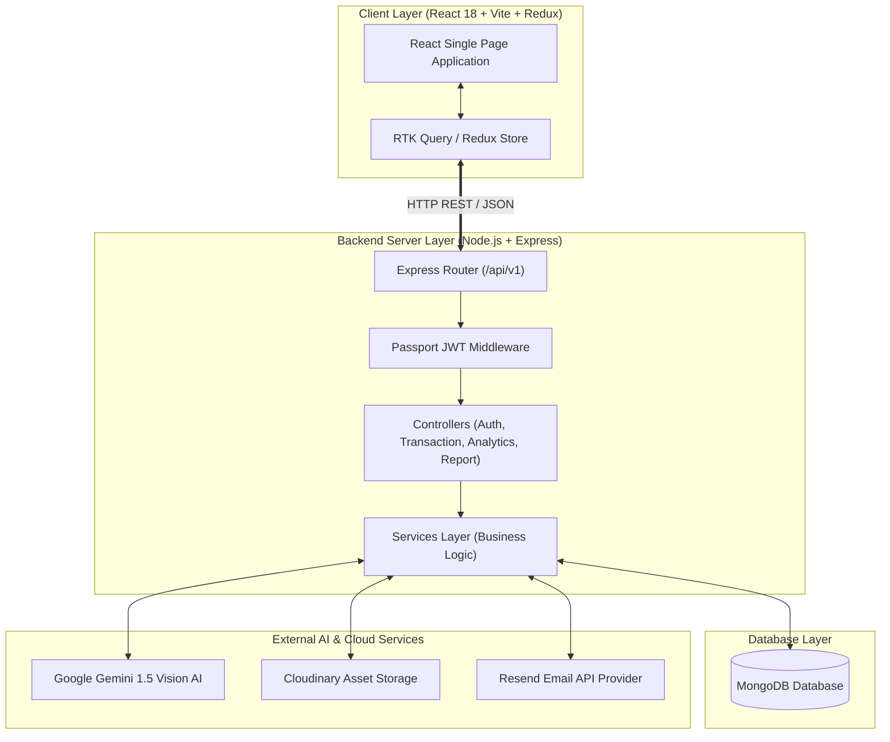
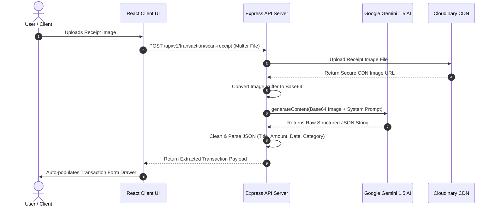
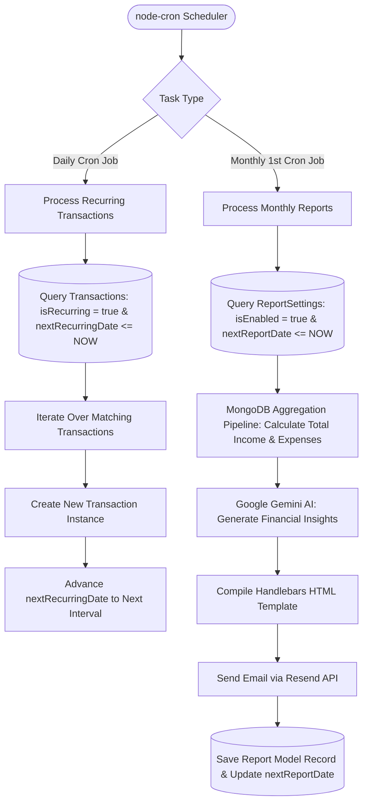
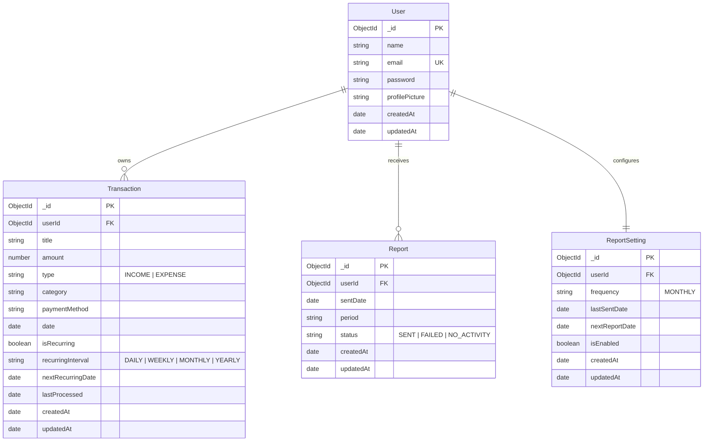

# Finora System Architecture & Component Design

## 🏛️ High-Level System Architecture (Mermaid)

---

## 🤖 AI Receipt OCR Sequence Flow (Mermaid)

---

## 🔄 Cron Automation Engine Architecture (Mermaid)

---

## 🗄️ Database Entity Relationship Diagram (ERD)

